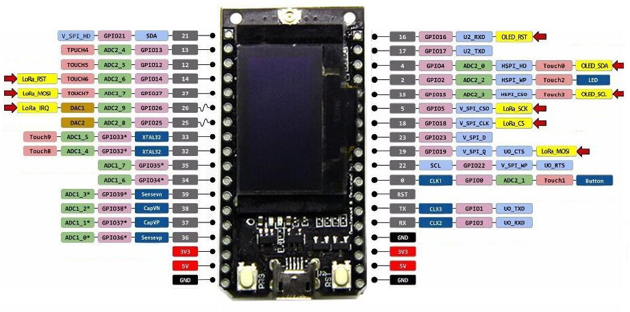
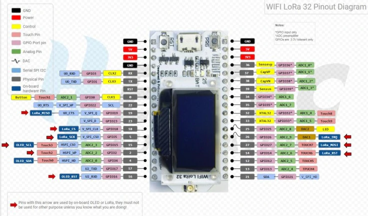
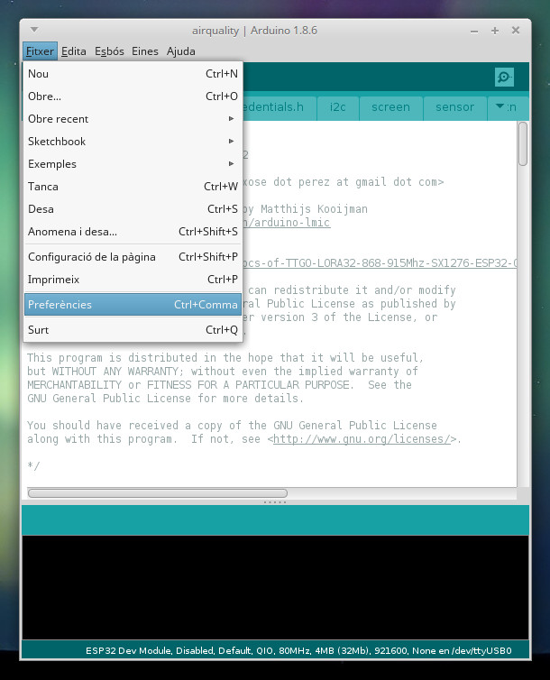
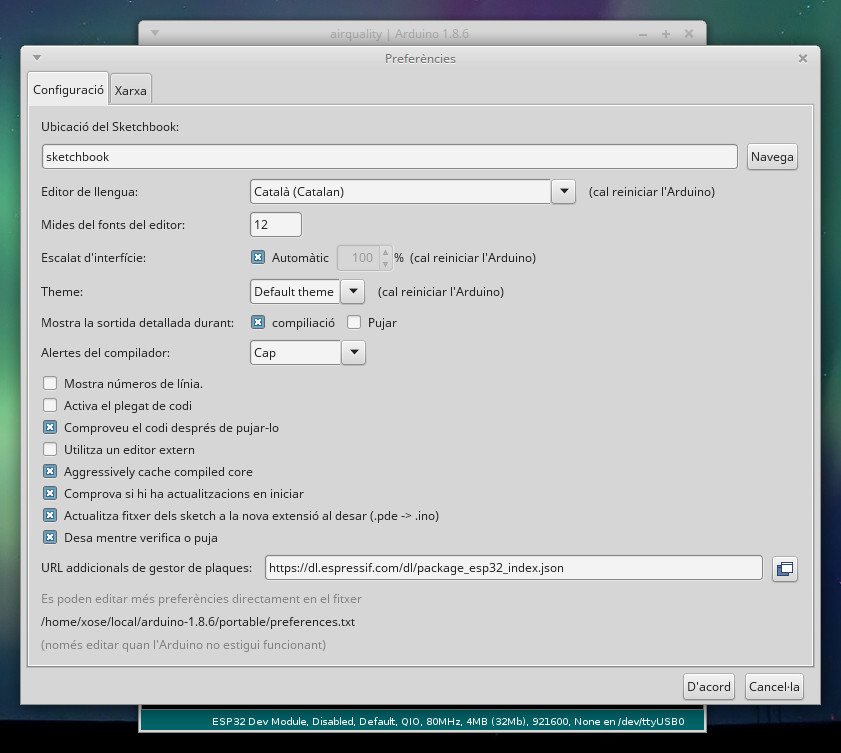
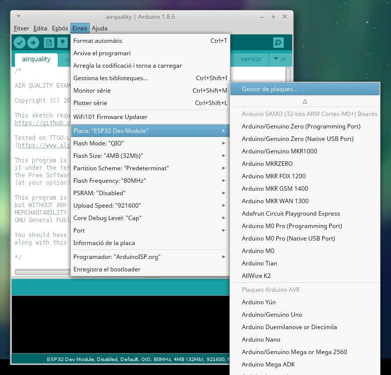
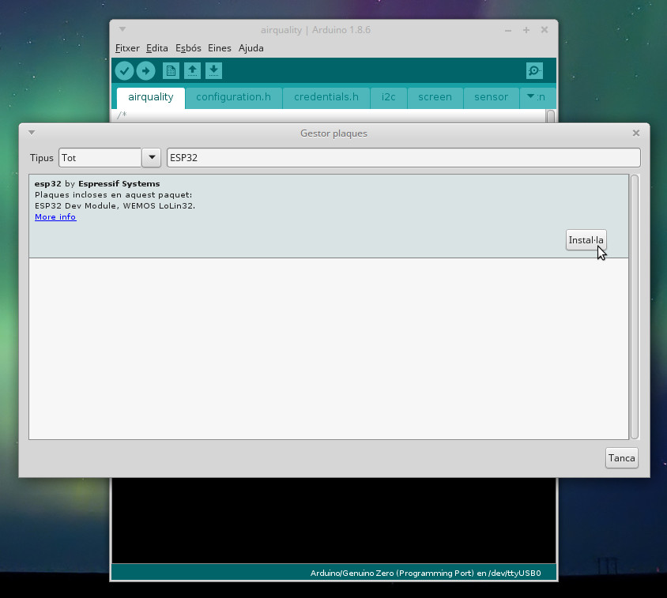
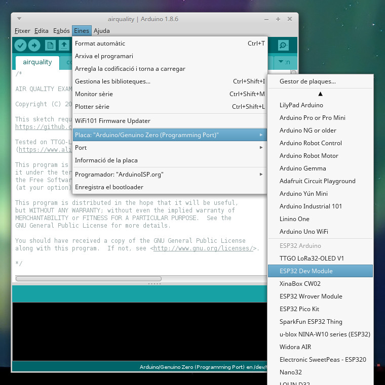
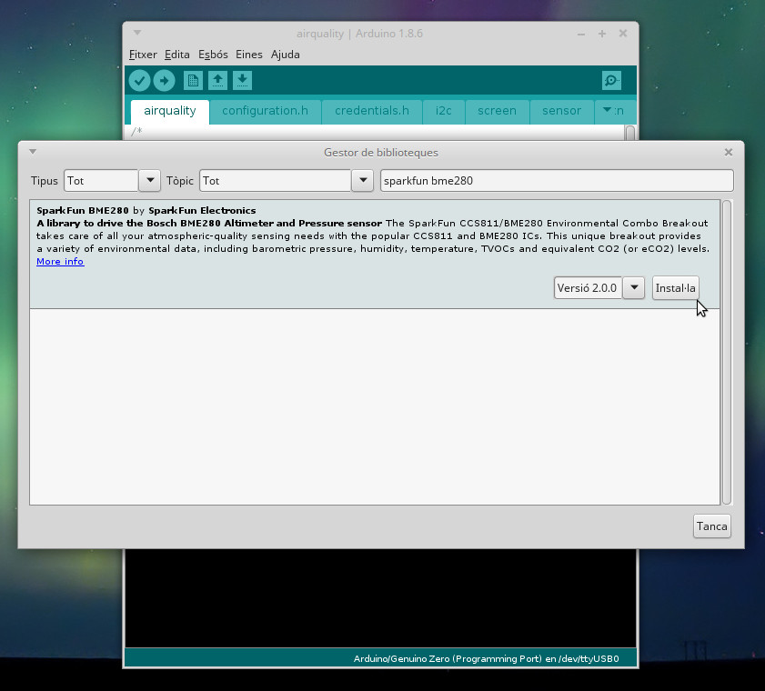
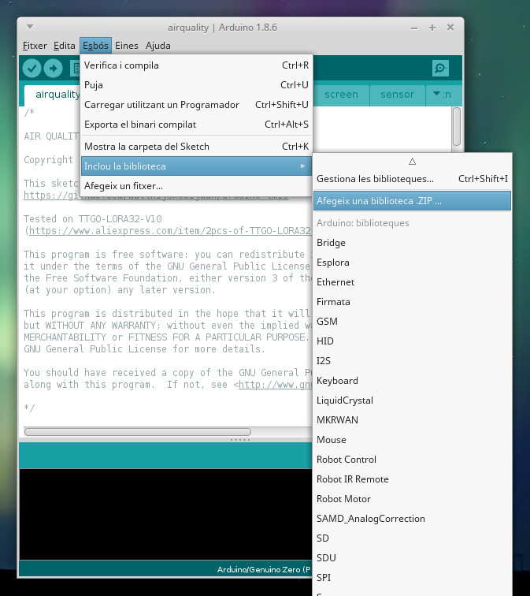

# Estació meteorològica amb un ESP32 + LoRa

Estació meteorològica ESP32 amb LoRa.

## Hardware

### Components

Una d'aquestes:

* TTGO LoRa32 ([Aliexpress](https://www.aliexpress.com/item/TTGO-LORA32-868-915Mhz-SX1276-ESP32-Oled-display-Bluetooth-WIFI-Lora/32840222847.html))
* Heltec LoRa32 ([Aliexpress](https://es.aliexpress.com/item/1000006969786.html))

Opcional:

* Sensor BME280 ([Aliexpress](https://www.aliexpress.com/item/High-Accuracy-BME280-Digital-Sensor-Temperature-Humidity-Barometric-Pressure-Sensor-Module-GY-BME280-I2C-SPI-1/32672210336.html))
* Cables i/o protoboard per fer les connexions

### Cablejat

Farem les següents connexions:

|TTGO|BME280|Funció|
|---|---|---|
|GND|GND|Alimentació -|
|3V3|VIN|Alimentació +|
|4|SDA|Dades I2C|
|15|SCL|Rellotge I2C|

## Configurar l'entorn de desenvolupament

#### IDE d'Arduino

Per treballar amb l'IDE d'Arduino necessitarem la darrera versió (1.8.X a data d'avui) i instal·lar suport per el microcontrolador ESP32 que fa servir la TTGO-LORA32 i les biblioteques necessàries per treballar amb el mòdul LoRa, la pantalla OLED i els sensors.

**Afegir suport per ESP32 a l'IDE d'Arduino**

El primer que hem de fer és afegir suport per el microcontrolador ESP32 d'Espressif a l'IDE d'Arduino. Aquest procés és força senzill. Només cal anar a `Fitxer > Preferències` i en el camp `URLs addicionals de gestor de plaques` indicar aquesta URL:

`https://dl.espressif.com/dl/package_esp32_index.json`

En cas que ja hi hagués alguna altra URL diferent podem separar-les per comes.

Un cop fet anirem a `Eines > Placa: "..." > Gestor de plaques...`. En el quadre de text buscarem `ESP32` i ens hauria de sortir una única opció. Cliquem a sobre i triem `Instal·la`. Començarà el procés de descàrrega i instal·lació dels fitxers necessaris per treballar amb aquest microcontrolador.

Si tot ha anat bé, a sota de `Eines > Placa: "..."` hauriem de veure una secció `ESP32 Arduino` i en particular una placa anomenada `ESP32 Dev Module` que seleccionarem.

La informació original d'aquest procediment la podeu trobar aquí:
https://github.com/espressif/arduino-esp32/blob/master/docs/arduino-ide/boards_manager.md

**Instal·lar les biblioteques necessàries**

Per aquest projecte necessitarem tres biblioteques. Les tres es poden trobar a la subcarpeta `libraries` d'aquesta mateixa carpeta. Aquestes biblioteques són:

* `ESP8266 and ESP32 Oled Driver for SSD1306 displays` per fer servir la pantalla OLED.
* `CayenneLPP` d'ElectronicCats per encapsular la informació (té una dependència en la biblioteca `ArduinoJson`)
* `Adafruit BME280 Library` per interactuar amb el sensor de temperatura, humitat i pressió (té una dependència en la biblioteca `Adafruit Unified Sensor`)
* `LMIC Arduino` per comunicar-nos amb el mòdul LoRa.

Aquestes biblioques le teniu disponibles des del gestor de biblioteques de l'IDE d'Arduino (sota `Esbós > Inclou la biblioteca > Gestiona les biblioteques...`) excepte la darrera.

L'altra l'haurem d'instal·lar direcment des de l'arxiu ZIP ja que la disponible en el Gestor de Biblioteques no ens serveix. Per fer-ho anem a `Esbós > Inclou la biblioteca > Afegeix una biblioteca .ZIP`, la busquem en el nostre ordinador i la instal·lem.

#### PlatformIO

El procés de configuració i instalació de dependències és automàtic amb PlatformIO. No has de fer res! :)

## Configurar el node

El primer que cal fer és configurar les dades per connectar-nos a TTN. Duplica l'arxiu `credentials.sample.h` amb el nom `credentials.h` i edita'l introduint-hi les dades apropiades segons el *backend* the TTN.

## Compilar i pujar el codi

#### IDE d'Arduino

Primer ens assegurarem que tenim la placa conectada via USB a l'ordinador. Anirem a `Eines > Placa: "..."` i seleccionarem la placa anomenada `ESP32 Dev Module` si no ho hem fet ja. Després sota la opció `Eines > Port...` ens assegurarem que està seleccionat el port de comunicació on tenim la placa. Normalment només hi haurà un, o sigui que serà fàcil saber quin és.

El primer botó de la botonera de l'IDE d'Arduino ens permet "compilar" el programa. Aquí podrem si tot està bé, si no hi ha errors en el codi o dependències no complertes. Si tot va bé mostrarà el missatge "Compilat".

Després ja podem pujar el codi a la placa fent servir el segon botó de la botonera de l'IDE. Si tot va bé mostrarà el missatge "Pujat". Aleshores podrem obrir el monitor sèrie (el botó més a la dreta de la botonera) i veure els missatges de la placa.

Funciona?

#### PlatformIO

Per compilar i pujar el codi fent servir PlatformIO només cal escriure: `pio run -t upload`. Fàcil, no?

### License

Copyright (C) 2021 by Xose Pérez (@xoseperez)

This code is free software: you can redistribute it and/or modify
it under the terms of the GNU General Public License as published by
the Free Software Foundation, either version 3 of the License, or
(at your option) any later version.

This code is distributed in the hope that it will be useful,
but WITHOUT ANY WARRANTY; without even the implied warranty of
MERCHANTABILITY or FITNESS FOR A PARTICULAR PURPOSE.  See the
GNU Lesser General Public License for more details.

You should have received a copy of the GNU General Public License
along with this code.  If not, see <http://www.gnu.org/licenses/>.
